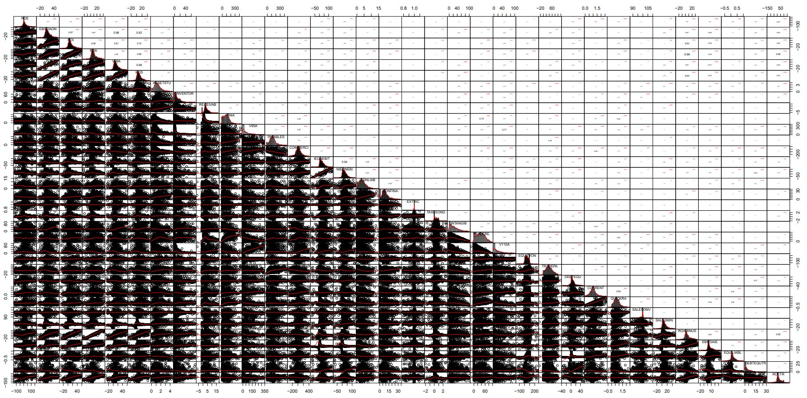

## Replacement of NA encoded outliers by multidimensional interpolation

In the previous section (step9), we have detected “extreme outliers” and encoded them as NA (not Available) 
However, most AI methods require the processing FULL datatables. 

In sction 4.5.9.1 Treatment of outliers and shapes of distributions (pp 164-165), the authors propose to “fill in” the masqued outliers with either the mean or the median of each of the Ratio Variable statistical distribution. 
Although it is common practice, <em>this method is based on a very thin probability theory argument</em>.  

The present dataset being essentially “multidimensional” it is better justified to proceed with the replacement of the NA values on the basis of the multidimensional relations existing between the Ratio Variables rather than processing them individually. In our case, all variables being numerical (see list below), we will apply Principal Componant Analysis (PCA) and follow by an "interpolation" of the missong valeus based on the PCA factor space vectors. This is performed using the missMDA R package (-> https://cran.r-project.org/web/packages/missMDA/index.html) following a PCA detremined using the FactoMineR R package (-> https://cran.r-project.org/web/packages/FactoMineR/index.html)

> \# Checking on variables type in the datatable 
> sapply(wcs2train.ratios.NA, class) 

##### <em>The printed output is:
&nbsp;      ROE  EBITDAON       ROI       ROA      V89A       ROS  ASSETSTU  INVENTOR  RECEIVAB      V94A      V95A  PAYABLES  COMMERCI  IEONEBIT  NIEONEBI  IEONLIAB IEONFINA.    EXTRIC  TAXESONG  INTANGIB  TRADERE.     V110A  EQUITYON TRADEPA.   DEBTEQU   CURRENT   QUICKRA  SALESONV  SALESMIN  ROAMINUS  EBITDAIE EQUILIABL DEBTEQUTR     ROET  
&nbsp;      "numeric" "numeric" "numeric" "numeric" "numeric" "numeric" "numeric" "numeric" "numeric" "numeric" "numeric" "numeric" "numeric" "numeric" "numeric" "numeric" "numeric" "numeric" "numeric" "numeric" "numeric" "numeric" "numeric" "numeric" "numeric" "numeric" "numeric" "numeric" "numeric" "numeric" "numeric" "numeric" "numeric" "integer" </em>

> \# Loading the necessary processing libraries 
> library(FactoMineR) 
> library(missMDA) 
> \# Estimate the number of PCA components necessary for a correct interpolation of NAs 
> ncomp <- estim_ncpPCA(wcs2train.ratios.NA) 
> \# Perform multidimensional interpolation of NA values using the MissMDA method 
> res.imp <- imputePCA(wcs2train.ratios.NA, ncp = ncomp$ncp) 
> \# Extract the NA completed rows 
> wcs2train.ratios.CT <- res.imp$completeObs[1:nrow(wcs2train.ratios.NA),] 

### Comparison of Ratio Variables range and statistics before and after “outliers” processing

We compare the Ratio Variables range and statistics between the corrected datatable wcs2train.ratios.CT and the uncorrected “original” datatable wcs2train.ratios using the built in summry() function from the standard R package.

> summary(wcs2train.ratios.CT)
> summary(wcs2train.ratios)

<em>NOTE: </em> We are not presenting here the printed ouputs of these two functions as they are being too bulky  
From these outputs it is esasy to see that the mean and median of each variable are comparable befaore and after processing but that the Min. and Max; “extreme” values have been somewhat “reined in” by the NA values replacement to the exception of vriaables such as V110A for which no outliers were detected (see previous section)

### Study of Ratio Variables correlation properties after “outliers” processing

<strong>A first approach is to graphically evaluate the multi-dimensional variable correlation chart</strong> produced by the chart.Correlation() function belonging to the erformanceAnalytics  R package (-> https://cran.r-project.org/web/packages/PerformanceAnalytics/index.html)

> library("PerformanceAnalytics") 
> chart.Correlation(wcs2train.ratios.CT, histogram=TRUE, pch=19) 

Illustrated in: Outlier-Treatment_Page165_AllvariableswithCT_CoorDiag.pdf

<em>NOTE :</em> In this chart, the cloud points of Corrected data are strikingly similar to those presented in the datatable with outliers masked as NAs (-> https://github.com/MoiraCorp/DLMM-IRating-in-R/tree/main/steps/step9/naoutlr)

<strong>A second approach is to compare the pair-wise correlation coefficients between variables </strong> as it has been proposed in Step 8 (-> https://github.com/MoiraCorp/DLMM-IRating-in-R/tree/main/steps/step8/allvar).  This process enables to determine potentiala groups of similar behaved variables. It is done using the corrplot R package (-> https://cran.r-project.org/web/packages/corrplot/vignettes/corrplot-intro.html)

