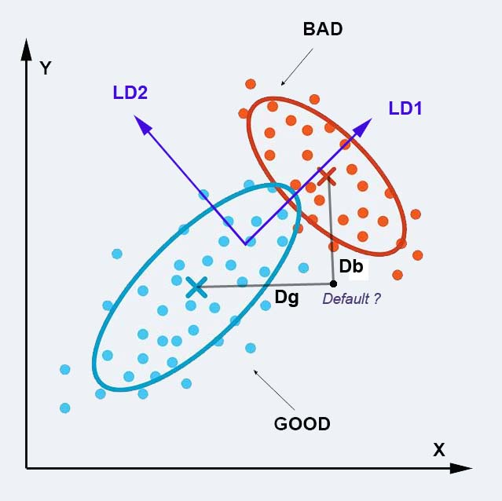

# Linear Discriminant Analysis - Initial approach

Here we follow step by step the contents of Chap. 4, section 4.6.2 : Linear discriminant analysis, pp. 185-210 

## Purpose

The authors are proposing to use Linear Discriminant Analysis method (LDA) in order to solve the problem of estimating the Probability of Default (PD) of a paticular company using its financial accounts. 
Like most of the Machine learning (ML) methods it is conducted in two phases: 
- A **training phase** which determines the statistical characteristics of a representative sample of both GOOD (idem, stable) companies and BD (idem, having defaulted companies). The parameters of the ML model are then determined from these characteristics.
- An **application (or prediction phase)** when the model is used in order to predict the Probability of Default (PD) of any other company over a period which is generally the next year

In the case of Linear Discriminant Analysis method (LDA):
- The **training phase** is conducted in two steps:
  1. Each group is characterized by its average vector (or center of gravity) **M** and its matrix of variane-covariance **Σ**
  2. The LDA algorithm determines a new set of coordinates which maximises the separability between groups.   (In the illustration below, we go from original dimensions to new LD1,LD2 dimensions)
- The **prediction phase** is also conducted in two steps:
  1. The Mahalanobis distance between a new company X and the center of a particular group is determined as :  **D = (X - M)t * Σ-1 * (X - M)**. In our case, two distances are computed: Dg (GOOD) and Db (BAD)
  2. The new company is then assigned to the closest group. The Mahalanobis distance being the square root of the negative Log likelihood, the probabilty (idem, likelihood) of a company to belong to this group is computed as: **p = 1/2 * e-D2** 
  Its is taken as the **Probability of Default (PD)**

The principles of Linear Discriminant Analysis (LDA)
  

<em>NOTE:</em> In the present problem, **we have 34 ratios (dimensions) in our data space**. The dataset is composed of **1221 GOOD companies** and **52 BAD companies**. 
For comparison, in the initial work from Altman which led to the well kwown Z-score:
Altman, E.I., 1968. Financial ratios, discriminant analysis and the prediction of corporate bankruptcy. The journal of finance, 23(4), pp.589-609. https://www.jstor.org/stable/2978933  
the author used 5 ratios with a balanced training data set of 33 GOOD companies and 33 BAD companies.

## Method

> 
<strong>Data preparation</strong> - -> (https://github.com/MoiraCorp/DLMM-IRating-in-R/tree/main/steps/step12/dataprep)

> 
<strong>First run LDA on original data</strong> - -> (https://github.com/MoiraCorp/DLMM-IRating-in-R/tree/main/steps/step12/firstorgdat)

> 
<strong>LDA on decorrelated variables using a prior PCA</strong> - -> (https://github.com/MoiraCorp/DLMM-IRating-in-R/tree/main/steps/step12/priorpca)

> 
<strong>Stepwise LDA on original data</strong> - -> (https://github.com/MoiraCorp/DLMM-IRating-in-R/tree/main/steps/step12/stepwise)

> 
<strong>LDA on full author’s datatable</strong> - -> (https://github.com/MoiraCorp/DLMM-IRating-in-R/tree/main/steps/step12/fullauthdat)

