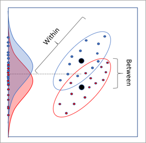

## Exploring Gaussian Copula encoding (Anamorphosis) 

The gaussian anamorphosis, known also as **Gaussian Copula encoding** is a mathematical function which transforms a variable X with any density distribution into a new variable Y with a Gaussian density distribution. As the Linear Discriminant Analysis method is based on the comparison between GOOD and BAD groups which variables are normaly distributed (idem, Gaussian), Gaussian Copula encoding is a way to adapt the data so that it optimaly fits the LDA instrument. 

This aspect of data pre-processing is addressed by the authors in section 4.5.9 Transformation of indicators (pages: 164-177). Although it is there essentially based on the use of formula based transformations and not in terms of a transformative transition between probability distributions.
We have in particular evaluated the use of the LOGIT recoding function in: evaluated Step10 - Transformation of indicators using a logistic formula: the case of the ROE ratio - -> (https://github.com/MoiraCorp/DLMM-IRating-in-R/tree/main/steps/step10/logencode)

Mahalanobis distance

Illlustration of LDA with two groups

Citing Minimage for Albuisson M. gausian anamorphosis
Wald, L., Albuisson, M., Best, C., Delamare, C., Dumortier, D., Gaboardi, E., Hammer, A., Heinnemann, D., Kift, R., Kunz, S. and Lefèvre, M., 2002. SoDa: a project for the integration and exploitation of networked solar radiation databases. In Environmental Communication in the Information Society (pp. 713-720). International Society for Environmental Protection, Vienna, Austria. https://www.aramis.admin.ch/Default?DocumentID=50870&Load=true

Gaussian anamorphosis
Matheron, G., 1978. Le krigeage disjonctif et le paramétrage local des réserves, cours C-76. Fontainebleau: Centre de Géostatistique, Ecole des Mines de Paris.
https://cg.ensmp.fr/bibliotheque/public/MATHERON_Cours_00211.pdf

Introduction the concept of probability distribution transition
Benzécri, J.P., 1976. Histoire et préhistoire de l'analyse des données. Partie III Era piscatoria. Les cahiers de l'analyse des données, 1(3), pp.221-241.
https://www.numdam.org/item/CAD_1976__1_3_221_0.pdf

Illlustration of probability transition

Introduction of correspondence analysis
Benzécri, J.P., 1969. Statistical analysis as a tool to make patterns emerge from data. In Methodologies of pattern recognition (pp. 35-74). Academic Press.
https://helios2.mi.parisdescartes.fr/~lerb/publications/HONOLULU.pdf
