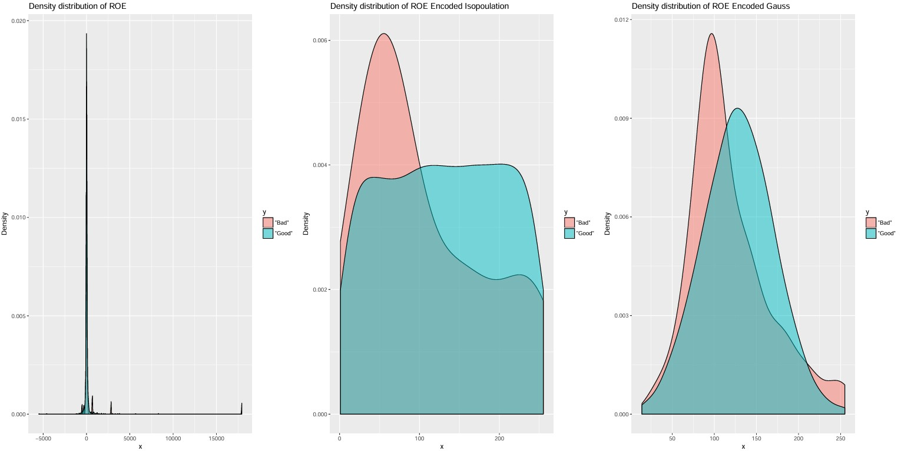

## Testing GOOD-BAD separability with Uniform and Gaussian Copula encoding

We are testing the effect of the Gauss Copula encoding on the separability between BAD and GOOD groups for the ROE ratio.

> library(ggplot2)  
> library("gridExtra")  
> my_plots = list()  
> \# 3 figures arranged in 1 rows and 3 columns  
> 	x <- wcs2train$ROE  
> 	y <- wcs2train$BADGOOD  
> 	d <- data.frame(x,y)  
> 	my_plots[[1]] <- qplot(x, data=d, geom="density", fill=y, alpha=I(.5),   
   		main = sprintf("Density distribution of ROE"), xlab="x",   
  		ylab="Density")  
> 	x <- ROE256  
> 	y <- wcs2train$BADGOOD  
> 	d <- data.frame(x,y)  
> 	my_plots[[2]] <- qplot(x, data=d, geom="density", fill=y, alpha=I(.5),   
   		main = sprintf("Density distribution of ROE Encoded Isopopulation"), xlab="x",   
  		ylab="Density")  
> 	x <- ROE256G  
> 	y <- wcs2train$BADGOOD  
> 	d <- data.frame(x,y)  
> 	my_plots[[3]] <- qplot(x, data=d, geom="density", fill=y, alpha=I(.5),   
   		main = sprintf("Density distribution of ROE Encoded Gauss"), xlab="x",   
  		ylab="Density")  
> grid.arrange(grobs = my_plots, nrow = 1)  

Illustrated in: Separability_BAD-GOOD_ROE_to_Isopulation_to_Gauss.pdf 
 
<em>NOTE:</em> Despite overlap, **a useful and clear cutting point appears** for both isopopulation and Gauss copula encoding
