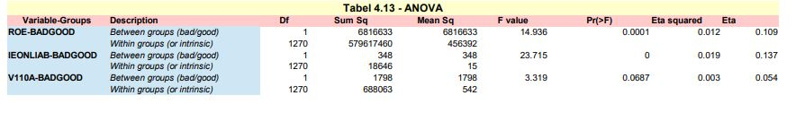

# Evaluating the good/bad discriminant power of a variable

It follows the section: 4.5.5 Discriminant power (page 145 of the DLMM book) 

### ANOVA of variable-BADGOOD assocation

> wcs2train.lmROE = lm(ROE ~ BADGOOD, data = wcs2train) 
> summary(wcs2train.lmROE) 
> anvROE <- anova(wcs2train.lmROE) 
> write.csv(anvROE, file = "C:/Projets_En_Cours/AI_MTPL/UCI_Internal_Ratings/R Notes/anvROE.csv") 

This code is repeated for variables IEONLAB and V110A saving the results in tables: anvIEONLIAB.csv and anvV110A.csv 

The results for the 3 variables ROE, IEONLAB and V110A are collated in one table in Table_4_13_ANOVA.xls  
in order to match the presentation in the DLMM book on page 150 

### ETA – Measure of variable-BADGOOD association
Eta-squared is the sample proportion of variance explained in a numerical variable by a categorical predictor variable. 
Eta2 is computed as between-groups sum of squares divided by total sum of squares. Eta is the square root of Eta.

It is computed from inside the file Table_4_13_ANOVA.xls

### Chi-square (Pearson) test of association between two categorical variables SECTOR-BADGOOD
Here we are mirroring the SPSS Chi-Square Independence Test -> https://www.spss-tutorials.com/spss-chi-square-independence-test/ 
in order to mimic the results illustrated in Table 4.15 - Chi-square test presented in the DLMM book on page 151 
In order to do so, we need to perform the following tasks :
- Pearson Chi-Square test
- Likelihodd Ratio test
- Linear-by-Linear Association  

 <em>NOTE:</em> in the IBM's support page for SPSS, it is stated in a technote on the Chi² test: 
'The Crosstabs procedure includes the Mantel-Haenszel test of trend among its chi-square test statistics. ...  
The MH test for trend will be printed in the "Chi-Square Tests" table and labelled "Linear-by-Linear Association".' 

#### Pearson Chi-Square test
Here we use the standard chisq.test() function from the R package
> tbl <- table(wcs2train$SECTOR, wcs2train$BADGOOD) 
> chisq.test(tbl) 

##### <em>The printed output is: 
&nbsp; Pearson's Chi-squared test 
&nbsp; data:  tbl 
&nbsp; X-squared = 4.2799, df = 18, p-value = 0.9996</em> 

#### Likelihood Ratio test
#### Linear-by-Linear Association

### Phi and Cramer’s V measures

### ROC curves and Area under ROC (AuROC) 
#### ROC numerical summaries
#### ROC curves graphical representation
#### Computing ROC test on the whole set of variables

