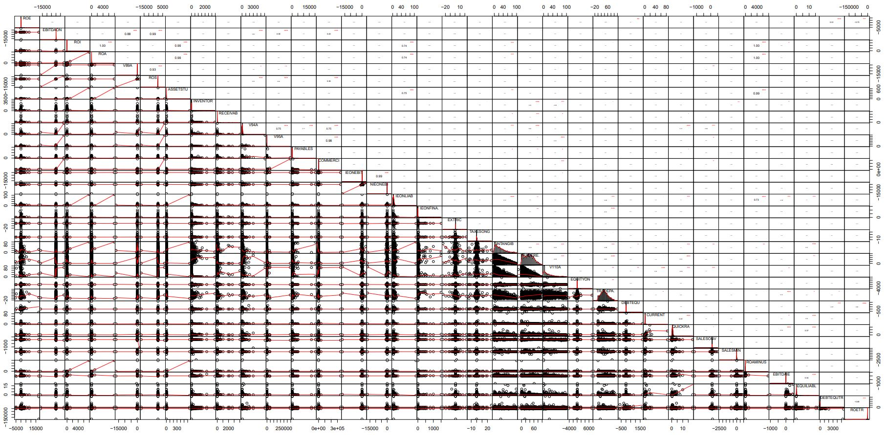
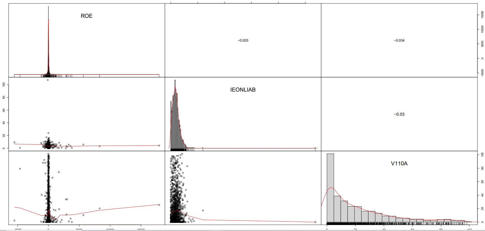

## Using another correlation display from R

This kind of display display gives a “direct” impression of the bi-variate cloud points. 
It uses the chart.Correlation() function from the PerformanceAnalytics R package -> https://cran.r-project.org/web/packages/PerformanceAnalytics/index.html

### Correlation diagram covering the whole set of ratio variables

> chart.Correlation(wcs2train[,c(86:119)], histogram=TRUE, pch=19)

Illustrated in Table_4_19d_Page162_Allvariables_CoorDiag.pdf

### Correlation diagram for a select set of variables: ROE, IEONLIAB and V110A

> chart.Correlation(wcs2train[,c(86,101,107)], histogram=TRUE, pch=19)

Illustrated in Table_4_19c_Page161_3variables_CoorDiag.pdf

<em>NOTE : </em> From this display, it is apparent that “outliers” play an important role in the charactersization of correlation properties, in particaular in the case of ROE.
The subject of “outliers” is dealt with in the next section.
