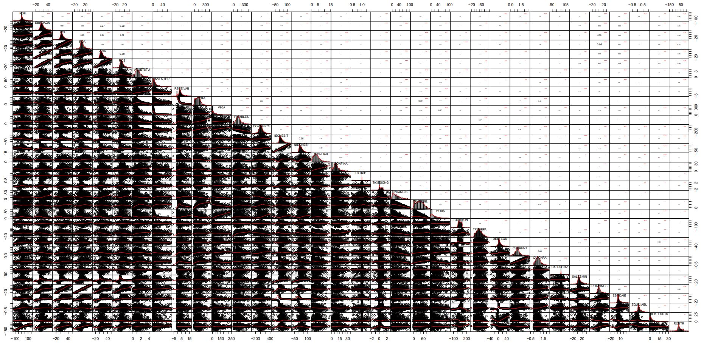

## Masking outlier's values using the NA R notation

It is common practice to “mask out” outlier values for each of the Ratio variables in order to manipulate more manageable statistical distributions. 
It follows the recommendations of the authors in section 4.5.9.1 – Treatment of outliers, page 164. 
Here we will mask out the outliers by replacing these values by the NA R notation (Not Available) 

### Encoding Outliers values as NA

> wcs2train.ratios.NA <- wcs2train.ratios 
> for(i in 1:length(wcs2train.ratios.NA)){ 
> \# use the function to identify extreme outliers 
> extreme.outl <- FindOutliers(wcs2train.ratios.NA[,i]) 
> \# Replacing extreme outliers values by NA 
> wcs2train.ratios.NA[,i][extreme.outl] <- NA 
> cat(sprintf("%s\n", colnames(wcs2train.ratios)[i])) 
> } 

In order to graphically evaluate the effects of this ecoding we use the chart.Correlation() from the PerformanceAnalytics R package -> https://cran.r-project.org/web/packages/PerformanceAnalytics/index.html 

> library("PerformanceAnalytics") 
> chart.Correlation(wcs2train.ratios.NA, histogram=TRUE, pch=19)

The result is illustared in Table_4_21b_Page164_AllvariableswithNA_CoorDiag.pdf
 

<em>NOTE :</em> In this chart, the cloud points provide far more information than the one presented in the unprocessed datable with outliers present (-> https://github.com/MoiraCorp/DLMM-IRating-in-R/tree/main/steps/step8/alternr)

### Recomputing the Pearson correlation matrix with outlier values removed

In order to compute the matrix of p-value,  we use the custom cor.pvalue() R function already introduced in chapter "step8": -> https://github.com/MoiraCorp/DLMM-IRating-in-R/tree/main/steps/step8/selectvar
> \# Function computing the matrix of p-values 
> \# mat : is a matrix of data 
> \# ... : further arguments to pass to the native R cor.test function 
> cor.pvalue <- function(mat, ...) { 
>     mat <- as.matrix(mat) 
>     n <- ncol(mat) 
>     p.mat<- matrix(NA, n, n) 
>     diag(p.mat) <- 0 
>     for (i in 1:(n - 1)) { 
>         for (j in (i + 1):n) { 
>             tmp <- cor.test(mat[, i], mat[, j], ...) 
>             p.mat[i, j] <- p.mat[j, i] <- tmp$p.value 
>         } 
>     } 
>   colnames(p.mat) <- rownames(p.mat) <- colnames(mat) 
>   p.mat 
> } 

In order to produce a graphics representation of the Pearson correlation between all NA masqued Ratio Variables we are using the corrplot R package: -> https://cran.r-project.org/web/packages/corrplot/vignettes/corrplot-intro.html

> library(corrplot) 
> corrprs	<- cor(wcs2train.ratios.NA, use="pairwise", method="pearson") 
> p.mat <- cor.pvalue(wcs2train.ratios.NA) 
> col <- colorRampPalette(c("#BB4444", "#fcc3b8", "#FFFFFF", "#add2f7", "#4fc69d")) 
> corrplot(corrprs, method="color", col=col(200),   
>          type="upper",   
>          addCoef.col = "black", \# Add coefficient of correlation 
>         addCoefasPercent = TRUE, 
>          tl.col="black", tl.srt=45, #Text label color and rotation 
>          \# Combine with significance 
>          p.mat = p.mat, sig.level = 0.01, insig = "blank",  
>          \# hide correlation coefficient on the principal diagonal 
>          diag=FALSE  
>          ) 

The graphics representation of the Pearson correlation between all Na masqued Ratio Variables is presented in Table_4_21c_Page 164_RatioswithNA_Correlation.pdf 
 

<em>NOTE :</em> When comparing with the same diagram obtained in step 8 -> https://github.com/MoiraCorp/DLMM-IRating-in-R/tree/main/steps/step8/allvar 
it appears that, though groups of correlated variables do appear again in the new display, there are some remarquable differences

### Updating groups of variables with outlier values removed

